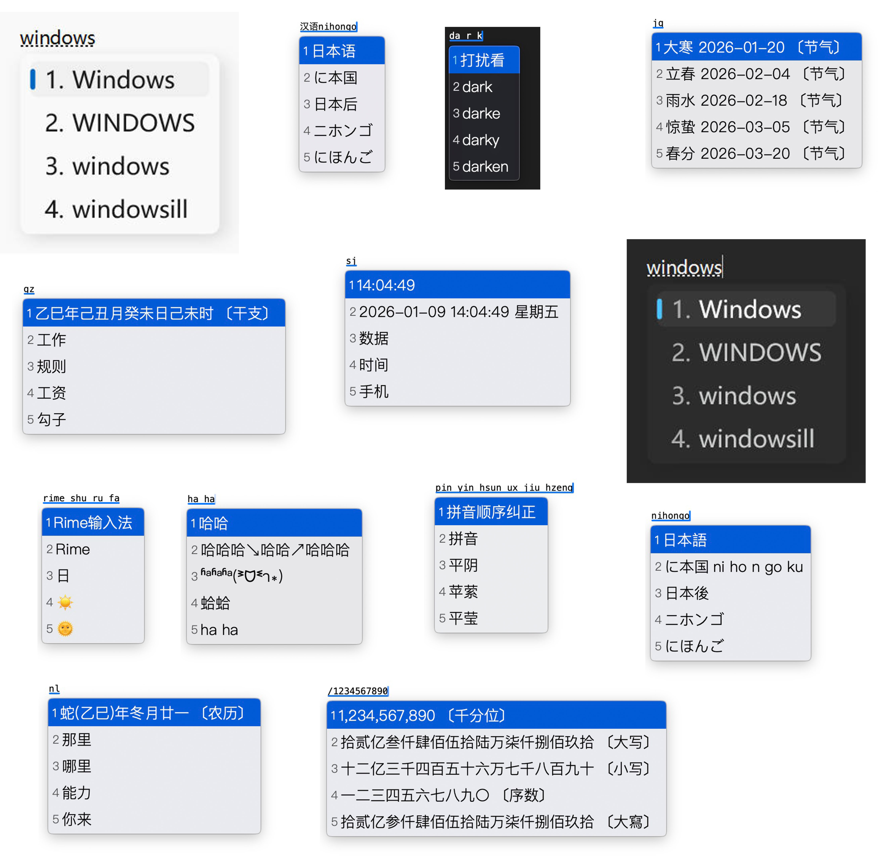

# [致第一次安装 Rime 的你](http://tieba.baidu.com/p/3288634121)

## 文档
- [设置教程](https://github.com/halfmoonvic/Rime/tree/master/doc)
- [ubuntu install rime](https://github.com/halfmoonvic/Rime/blob/master/doc/ubuntu_install_rime/ubuntu_install_rime.md)

## 基本功能

- 拼音、五笔、日本语
- 中英混输
- kaomoji 颜文字表情
- symbol 特殊符号（`/` + 字母）
- 全平台 `vim_mode` 模式（Linux 平台通过 lua 脚本实现）
- 数字千分位、大写数字（`/` + 数字）
- 时间（`time`、`shijian`、`sj`、`date`、`week`）
- 节气（`jq`、`jieqi`）
- 农历（`lunar`、`nongli`、`nl`）
- 反查中文（`p）
- 反查日语（`j）

## 输入法、词库

- [Iorest/rime-dict](https://github.com/Iorest/rime-dict?tab=readme-ov-file)
- [rime-japanese](https://github.com/gkovacs/rime-japanese)
- [五筆字型 86 版](https://github.com/rime/rime-wubi)

## 安装使用

1. 用户文件夹

   - windows weasel: `%APPDATA%\Rime`
   - mac squirrel: `~/library/rime`
   - ibus: `~/.config/ibus/rime`
   - fcitx5: `~/.local/share/fcitx5/rime`

2. clone 或者下载本仓库文件至以上对应的「用户文件夹」。

   熟悉 `git` 的话，也可以 `git pull`，`.gitignore` 已忽略用户词典等文件的变更

## 感谢 ❤️

- [librime-lua](https://github.com/hchunhui/librime-lua)
- [98wb](https://github.com/yanhuacuo/98wubi-tables)
- [fcitx5-vmodel](https://github.com/lei4519/rime-ice/blob/main/lua/vim_mode.lua)
