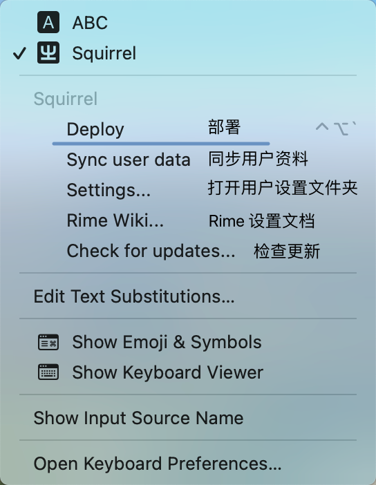
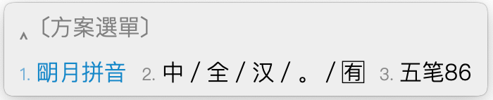

# 致第一次安装 Rime 的你

此文档是原贴 [致第一次安装 Rime 的你](http://tieba.baidu.com/p/3288634121) 分享链接的迁移。

# 一、用户界面选项

## 1.1 Rime Setting 界面



#### 1.1.1、 Deploy「部署」

对用户配置文件的修改每次均需通过此按钮使配置生效

#### 1.1.2、 Sync user data 「同步用户资料」

后面讲

#### 1.1.3、 Settings 「打开用户设置文件夹」

不同平台下用户配置文件夹路径如下：

【中州韻】 ibus-rime → Linux
【小狼毫】 Weasel → Windows
【鼠鬚管】 Squirrel → Mac OS X

Windows
Weasel: %APPDATA%\Rime
Mac OS X
Squirrel: ~/Library/Rime
Linux
iBus: ~/.config/ibus/rime
Fcitx: ~/.config/fcitx/rime

## 1.2 GUI [user.yaml](https://github.com/rime/home/wiki/UserData)



通过 GUI 界面，我们可以设置一些最为基本的设置，如选择拼音输入方案（默认为朙月拼音），
以及简繁体切换半角全角切换等。

#### 1.2.1、 简繁切换


#### 1.2.2、 方案选择


#### 1.2.3、 全角半角切换


以上三选项均可通过 `user.yaml` 进行设置

```yaml
var:
  option:
    full_shape: false # 半角
    simplification: true # 简体
  previously_selected_schema: luna_pinyin # 输入方案为朙月拼音
```

# [schema](https://github.com/rime/home/wiki/RimeWithSchemata#%E8%A9%B3%E8%A7%A3%E8%BC%B8%E5%85%A5%E6%96%B9%E6%A1%88)
question:   
请在较为详细的说下流程，比如我键盘敲击 “nihao“ 是怎样输出汉字 “你好” 的过程。
详细到 processors segmentors translators 里所具体采用的处理细节

ChatGPT answer:   
首先，"nihao" 这个字符串将会被 Rime 的输入法框架识别并传递给 processors 模块进行处理。这里的处理可能包括字符串的预处理，比如去除首尾空格，转换为小写字母等。

接下来，字符串将会被传递给 segmentors 模块进行分词，这里的分词是指将输入字符串分成一个一个的词语。在这个例子中，"nihao" 将会被分成 "ni" 和 "hao" 两个词语。

接下来，这两个词语将会被传递给 translators 模块进行翻译，也就是将拼音翻译成汉字。在这个例子中，"ni" 和 "hao" 将会被翻译成 "你" 和 "好"。

最后，翻译完的汉字将会被传递给 selector 和 navigator 模块进行选择和导航。Selector 模块负责选择最终的词语，也就是将 "你" 和 "好" 结合成一个词语 "你好"。Navigator 模块负责根据用户的选择结果进行导航，最终将词语 "你好" 输出到屏幕上。

# reference

搜狗细胞词库 [Rime 输入法简中用户新手套餐](https://github.com/ACsediment/RimeNewbie)
[Rime 词库扩展计划](https://github.com/Iorest/rime-dict)

https://github.com/rime/home/wiki/SharedData

https://github.com/rime/home/wiki/UserData

【中州韻】 ibus-rime → Linux
【小狼毫】 Weasel → Windows
【鼠鬚管】 Squirrel → Mac OS X
