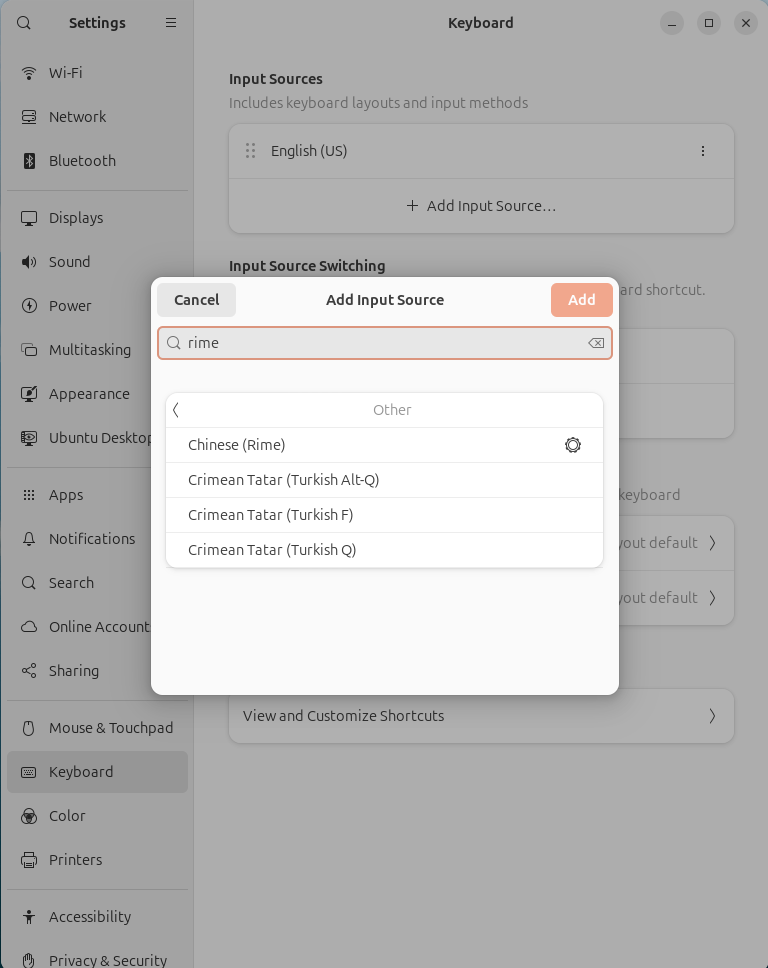
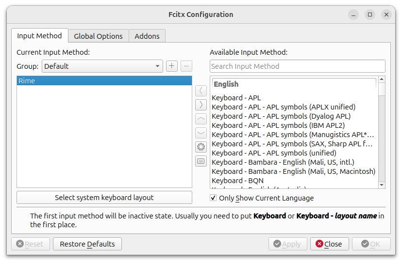
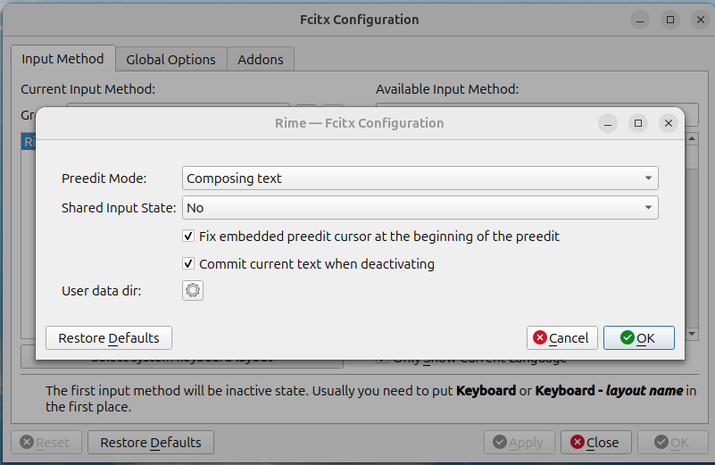

# linux input method layered architecture

apps don’t use Rime directly; they access it through **Input Method Framework**.

1. Application (GTK / Qt / X11)

   - **GTK**: A GUI toolkit commonly used in the GNOME ecosystem.
     Examples: GNOME Terminal, Gedit, and many native Linux apps.

   - **Qt**: A GUI toolkit commonly used in the KDE ecosystem.
     Examples: Dolphin, Kate, and most KDE applications.

   - **X11**: The traditional display/windowing system on Linux.
     you can think of it as a more low-level graphics/window system interface

2. Input Method Framework

   Examples: Fcitx5, IBus, Fcitx

   The manager/middleware that talks to apps, handles switching, and loads input method engine.

3. Input Method Engine

   Example: Rime

   The actual language engine that processes input rules, dictionaries, and candidate suggestions.

# 1. ibus-rime

https://github.com/rime/home/wiki/RimeWithIBus

## 1.1 install

```
sudo apt update && sudo apt upgrade

sudo apt install ibus-rime
```

## 1.2 environment

Tell different kinds of applications that their input method provider is ibus

```
vim ~/.xprofile

export GTK_IM_MODULE=ibus
export QT_IM_MODULE=ibus
export XMODIFIERS=@im=ibus

export SDL_IM_MODULE=ibus
```

## 1.3 im-config

Tell the system that the default input method framework is ibus

```
im-config -n ibus
```

## 1.4 enable rime in ibus

Tell the ibus framework to load and use Rime as an input method engine.

```
ibus-setup
    ↓
Input Method → Add → Chinese → Rime
```


or

```
Keyboard / Input Sources → Add → Chinese (Rime)
```



## 1.5 remove

```
sudo apt autoremove ibus-rime
```

# 2. fcitx5-rime

## 2.1 install

```
sudo apt update && sudo apt upgrade

sudo apt install fcitx5-rime
```

## 2.2 environment

Tell different kinds of applications that their input method provider is the fcitx family

```
vim ~/.xprofile

export GTK_IM_MODULE=fcitx
export QT_IM_MODULE=fcitx
export XMODIFIERS=@im=fcitx

export SDL_IM_MODULE=fcitx
```

## 2.3 im-config

Tell the system that the default input method framework is fcitx5, not ibus or others.

```
im-config -n fcitx5
```

## 2.4 enable rime in fcitx5

Tell the fcitx5 framework to load and use Rime as an input method engine.

```
fcitx5-configtool
    ↓
Available Input Method → Rime (select and put it into Current Input Method)
```



## 2.5 disable share input state

```
fcitx5-configtool
    ↓
Settings
```



## 2.5 remove

```
sudo apt autoremove fcitx5-rime
```

## 2.6 restart fcitx5

The fcitx5 framework is restarted to pick up the new configuration

```
fcitx5 -r
```

## 2.7 add to startup

startup applications

```
fcitx5
```
